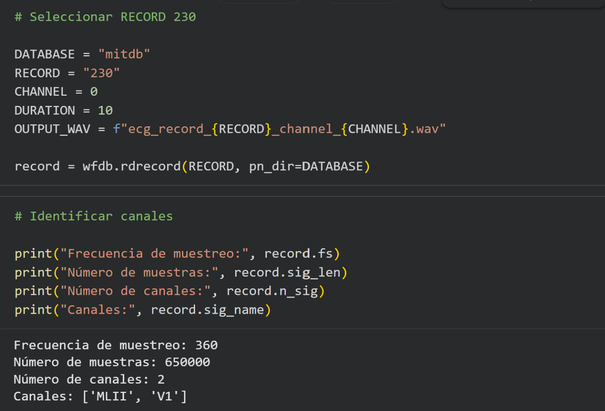
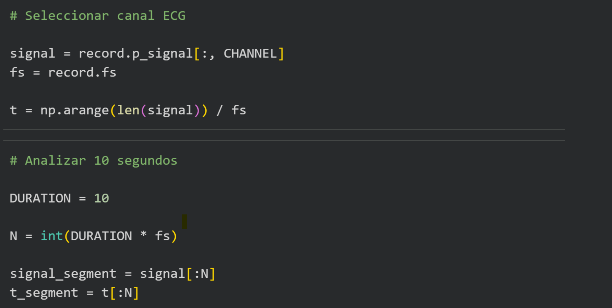
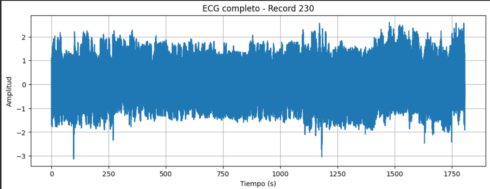
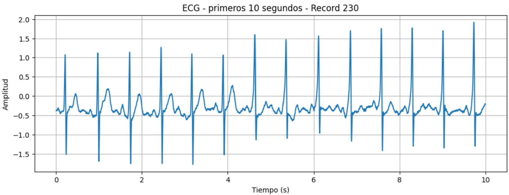
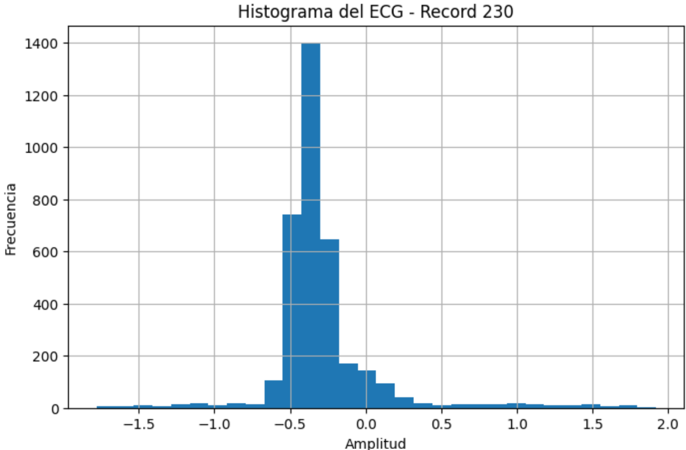
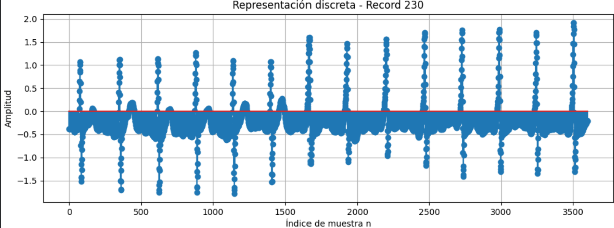
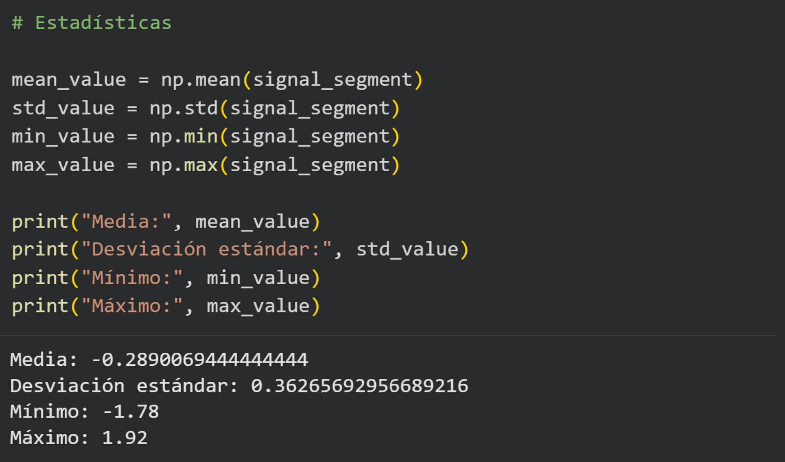
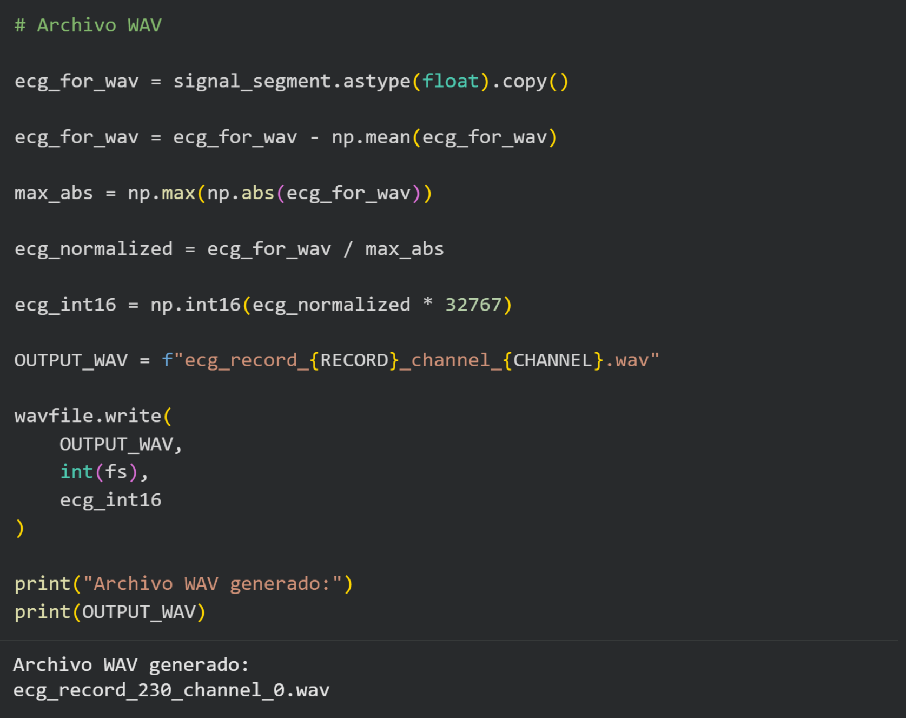

# Informe Lab 1

# 1. Identificación de base de datos
La base de datos es "mitdb" o MIT-BIH Arrhythmia Database

# 2. Identificación de registro
El registro utilizado es el 230

# 3. Frecuencia de muestreo
Como se muestra en el código, la frecuencia de muestreo es 360

# 4. Canal seleccionado
Se selecciona el primer canal, como se puede observar es el MLII

 

# 5. Duración analizada
Se analizan 10 segundos

# 6.1 Primera gráfica - ECG

# 6.2 Segunda gráfica - ECG primeros 10 segundos

# 6.3 Tercera gráfica - Histograma

# 6.4 Cuarta gráfica - Representación discreta

# 7. Estadísticas

# 8. Archivo WAV

# 9. Interpretación de resultados

En la gráfica ECG completa, si bien esta conserva una morfología similar a la del registro 100, esta posee un mayor rango de amplitud ya que va de -2 a 2 aproximadamente mientras que en el registro 100 va de -1 a 1. Además se observan ciertas perturbaciones que se observaban menos en el registro 100. Estas variaciones de amplitud son características de una señal electrocardiográfica.

En la gráfica de los primeros 10 segundo de ECG, el rango de amplitud vuelve a ser mayor ya que en este regitro es de -1.5 a 2 aproxiamdamente mientras que en el registro 100 es de -0.6 a 1 aproximadamente. Además, en este registro se observa como en un momento la señal ECG empieza a poseer mayores valores en el eje y, mientras que en el anterior registro, estos se mantienen siempre en el mismo rango. Estas variaciones de amplitud son características de una señal electrocardiográfica.

En la grafica de histograma, si bien ambos rangos de mayor concentración de mayor numero de muestras es similar en el eje de amplitud. En este registro el máximo número de muestras ronda los 1400 mientras que en el registro 100 ronda los 800. Los valores extremos poseen una menor frecuencia de muestras.

En la grafica de representación discreta, se demuestras que esta señal continua se puede representar por muestras discretas, sin que se modifique en tal punto la morfología que pierda similutd con la señal continua.

La media de −0.289 mV indica que, durante los 10 segundos analizados, los valores de amplitud de la señal ECG se encuentran ligeramente por debajo de 0 mV. La desviación estándar de 0.363 mV indica que existe una variación apreciable de los valores de amplitud alrededor de la media, que se menciono anteriormente. El valor mínimo de −1.78 mV y el máximo de 1.92 mV indican que, durante el segmento analizado, la señal presentó un rango de amplitud de 3.70mV.

# 10. Conclusiones

Se consiguió seleccionar un registro diferente dentro de la misma base de datos y a raíz de este interpretar distintos resultdos de acuerdo a las gráficas obtenidas y estadísticas

Se lograron identificar las principales características de la señal del registro seleccionado

Se consiguió representar la señal ECG mediante una represetnación continua y discreta

La señal ECG fue convertida a archivo WAV

