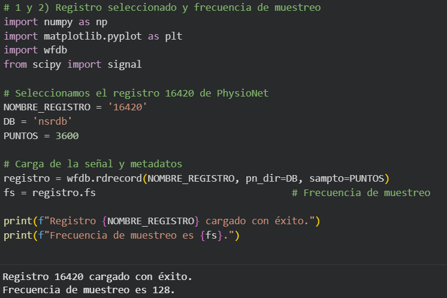
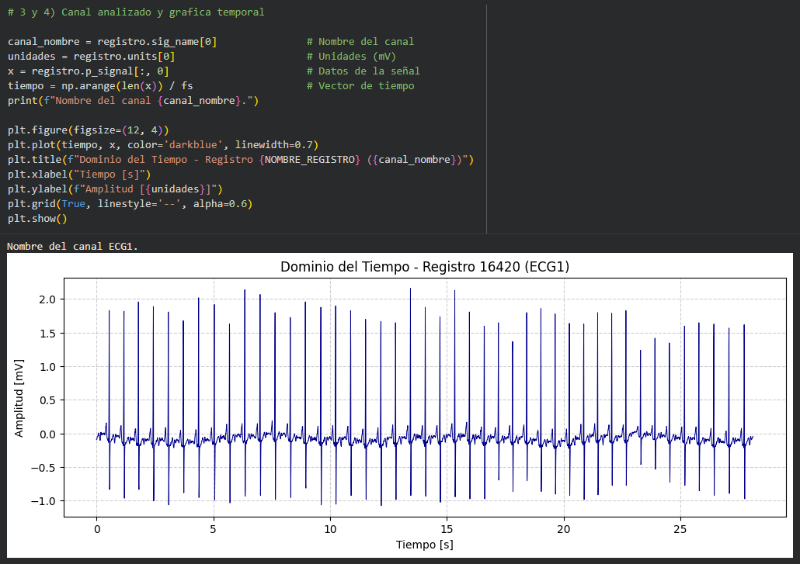
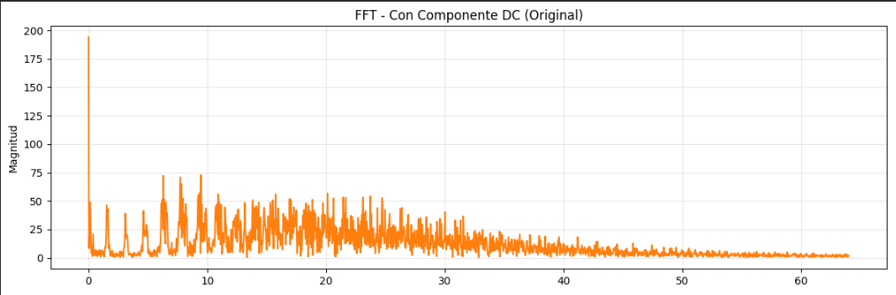
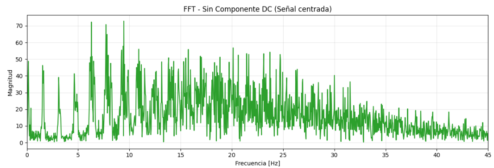
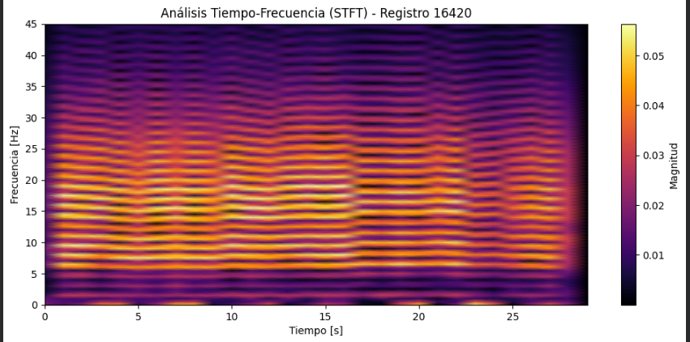

# Informe Final - Reto Final (Registro 16420)

## 1. Registro seleccionado
Se ha seleccionado el registro 16420 de la base de datos Normal Sinus Rhythm Database (nsrdb) de PhysioNet.

## 2. Frecuencia de muestreo
La frecuencia de muestreo (fs) es de 128 Hz.

## 3. Canal analizado
El análisis se realizó sobre el Canal 0, que corresponde a la señal ECG1.

## 4. Gráfica temporal
La señal en el tiempo muestra un ritmo sinusal rítmico con una amplitud que oscila entre -1.0 mV y 2.1 mV. Es una señal de morfología clara pero con menor amplitud pico a pico en comparación con otros registros analizados previamente.

## 5. FFT con DC
En el espectro de magnitud original, destaca un pico prominente en 0 Hz con una magnitud de 194.1. Este componente representa el nivel de offset (DC) de la señal y dificulta la observación detallada de las frecuencias fisiológicas bajas.

## 6. FFT sin DC
Tras eliminar la media, el pico en 0 Hz desaparece, revelando una frecuencia dominante en 9.458 Hz con una magnitud de 72.8. El grueso de la energía del ECG se distribuye principalmente entre los 0.5 y 35 Hz.

## 7. Espectrograma STFT
Utilizando una ventana de 256 muestras (nperseg), el espectrograma muestra bandas de energía horizontales estables. Se observa una pérdida de intensidad/potencia en las frecuencias superiores a partir del segundo 23 del registro.

## 8. Comparación de resultados
Al comparar el dominio temporal con el frecuencial, se confirma que la regularidad de los latidos en el tiempo se traduce en picos espectrales definidos en la FFT. La STFT complementa esto al mostrar que, aunque el ritmo parece constante en el tiempo, existe una dinámica de energía no estacionaria al final del tramo.

## 9. Respuestas a las preguntas de análisis
* **¿Por qué el espectro cambia al quitar DC?** Porque eliminamos el valor promedio que no contiene información de la variabilidad cardiaca.
* **¿Qué aporta la STFT aquí?** Identifica el momento exacto (s. 23) donde la señal pierde potencia, algo que la FFT global promedia y oculta.
* **¿Resolución utilizada?** Se eligió 256 muestras para priorizar la resolución en frecuencia y definir mejor las bandas del ECG.

## 10. Conclusiones
* El registro 16420 presenta un comportamiento rítmico pero con una atenuación de energía en altas frecuencias hacia el final del segmento.
* La eliminación de la componente DC es vital para el análisis espectral biomédico, permitiendo ajustar la escala a las magnitudes de interés fisiológico.
* El uso conjunto de FFT y STFT permite una comprensión total: qué frecuencias están presentes y en qué momento ocurren los cambios de energía.
