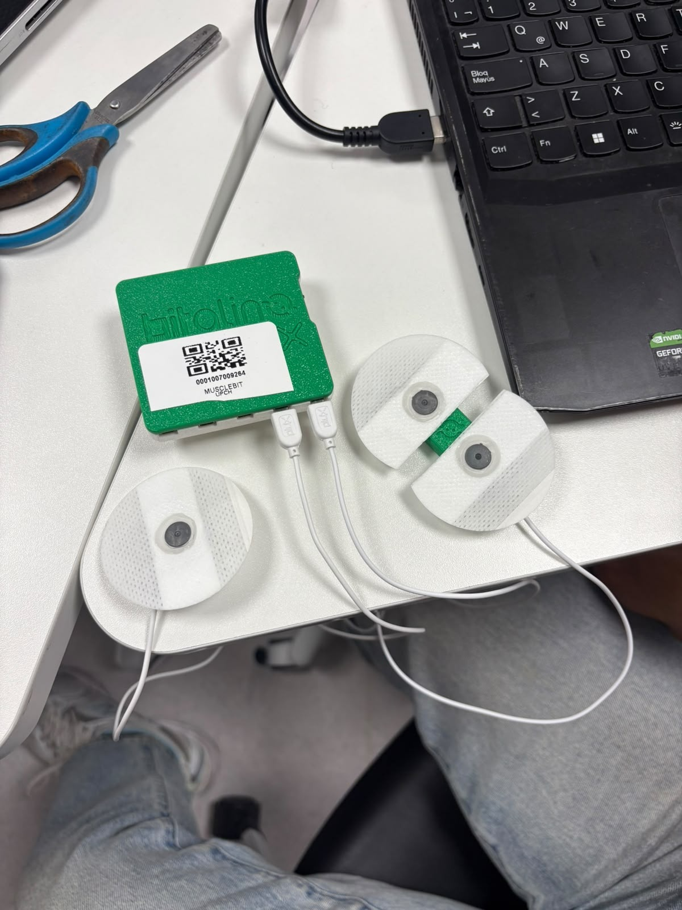
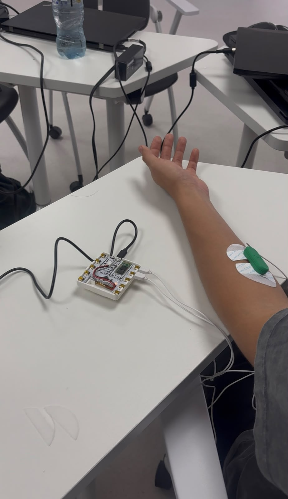
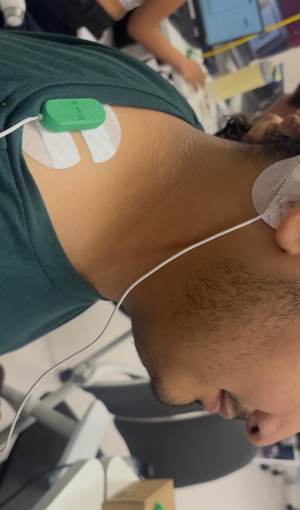
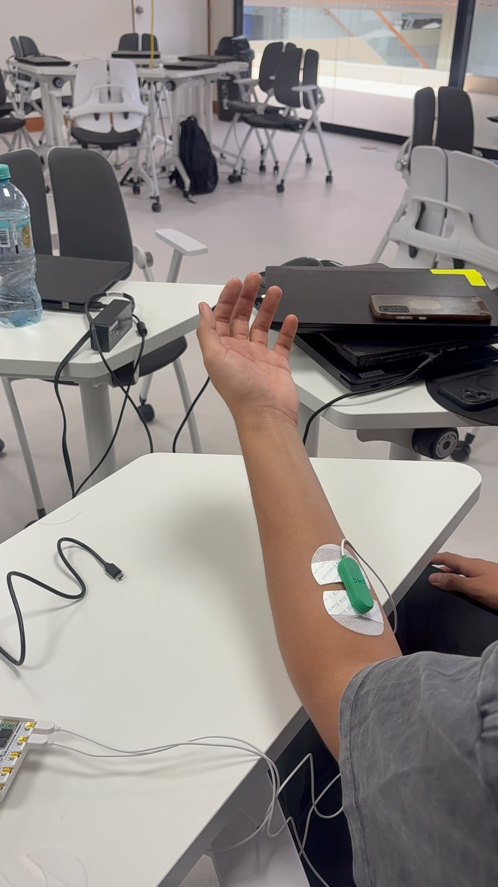
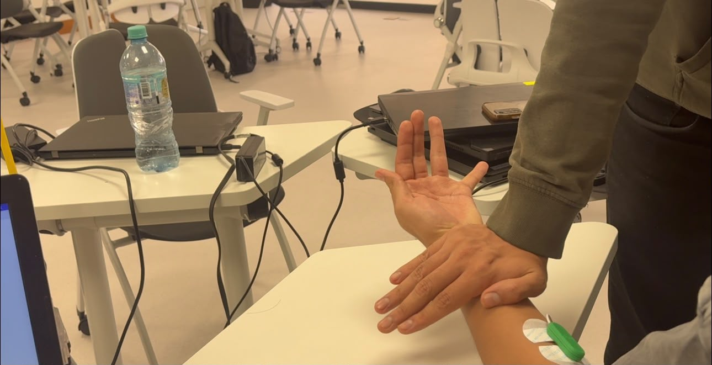

# Laboratorio: Registro de actividad muscular mediante electrodos

## 1. Introducción
En esta práctica se realizó el registro de la actividad eléctrica de dos grupos musculares mediante electrodos conectados a un dispositivo BITalino. Los músculos evaluados fueron el abductor y el trapecio.

El objetivo principal fue observar cómo cambia la señal electromiográfica (EMG) dependiendo del nivel de activación muscular. Para ello, primero se realizó una medición con el músculo en reposo y posteriormente se realizaron movimientos de diferente intensidad.

Las señales obtenidas fueron visualizadas inicialmente mediante OpenSignals y posteriormente se utilizaron los datos registrados para realizar el procesamiento y ploteo de la señal en Python.

## 2. Materiales utilizados
Para realizar la práctica se utilizaron los siguientes materiales:
- Dispositivo BITalino.
- Electrodos de superficie.
- Cables de conexión.
- Computadora.
- Software OpenSignals.
- Python para el procesamiento y visualización de los datos.

## 3. Conexión de los electrodos
Los electrodos fueron colocados sobre los grupos musculares seleccionados para registrar su actividad eléctrica durante el reposo y durante los movimientos.

Se realizaron mediciones sobre:
- **Grupo muscular 1:** Abductor.
- **Grupo muscular 2:** Trapecio.

La conexión se realizó entre los electrodos colocados sobre el cuerpo y el dispositivo BITalino mediante los cables correspondientes.

### 3.1. Conexión para el abductor

*Figura 1. Colocación de los electrodos para el registro de la actividad muscular del abductor.*

### 3.2. Conexión para el trapecio

*Figura 2. Colocación de los electrodos para el registro de la actividad muscular del trapecio.*

### 3.3. Conexión BITalino-cables

*Figura 3. Conexión del BITalino utilizada durante la práctica.*

## 4. Procedimiento experimental
Para realizar las mediciones se siguió una secuencia de registros con diferentes niveles de actividad muscular.

Primero se realizó un registro con el músculo en reposo, buscando obtener una señal de referencia de la actividad eléctrica del músculo sin realizar un movimiento voluntario.

Posteriormente, se realizaron movimientos de diferente intensidad. Para cada grupo muscular se realizaron:
- Registro en reposo.
- Tres rondas de movimiento leve.
- Tres rondas de movimiento con mayor fuerza.

La intención fue comparar visualmente la señal obtenida en reposo con las señales producidas durante los diferentes niveles de contracción muscular.

### Resumen de las mediciones

| Condición | Número de rondas |
| :--- | :---: |
| Reposo | 1 |
| Movimiento leve | 3 |
| Movimiento con fuerza | 3 |

## 5. Registro de la señal en reposo
Durante el registro en reposo se buscó mantener el músculo relajado para observar el nivel de actividad eléctrica basal.

[🎥 Ver video de demostración](videos/video1.mp4)

[🎥 Ver video de demostración](videos/video2.mp4)

En el video se debe poder observar:
- La conexión de los electrodos con el cuerpo.
- La conexión de los electrodos con el BITalino.
- La señal registrada durante el reposo.
- La señal siendo visualizada/plotteada.

### Señal en reposo

>[!NOTE]
> *[Insertar aquí captura de OpenSignals de la señal en reposo-OS1]*

*Figura 4. Señal electromiográfica registrada durante el reposo.*

Durante esta etapa se espera observar una señal de menor amplitud en comparación con los registros realizados durante la contracción muscular. Sin embargo, la señal no necesariamente será completamente plana, ya que pueden existir pequeñas variaciones debido a la actividad muscular involuntaria, movimiento, ruido eléctrico o interferencias producidas durante la medición.

## 6. Registro durante movimiento leve
Después del registro en reposo se realizaron tres rondas de movimiento leve.

El objetivo de esta etapa fue observar cómo la actividad eléctrica del músculo cambia cuando se realiza una contracción voluntaria de baja intensidad.

### Abductor

*Figura 5. Registro de la actividad muscular del abductor durante movimiento leve.*

### Trapecio

*Figura 6. Registro de la actividad muscular del trapecio durante movimiento leve.*

En comparación con el reposo, se puede observar un incremento en la amplitud de la señal durante los momentos en los que se produce la contracción muscular. Esto se debe a que durante la contracción se incrementa la actividad eléctrica asociada a la activación de las unidades motoras.

## 7. Registro durante movimiento con fuerza
Finalmente, se realizaron tres rondas de movimiento utilizando una mayor fuerza.

Esta medición permitió comparar la actividad muscular obtenida con la condición de movimiento leve.

### Abductor

*Figura 7. Actividad electromiográfica del abductor durante una contracción de mayor intensidad.*

### Trapecio

*Figura 8. Actividad electromiográfica del trapecio durante una contracción de mayor intensidad.*

En esta condición se esperaba obtener una señal con mayor amplitud respecto al movimiento leve, debido a la mayor activación muscular. Esto permite observar de manera cualitativa la relación entre la intensidad de la contracción y la actividad eléctrica registrada mediante los electrodos.

## 8. Ploteo de la señal en OpenSignals
Las señales obtenidas durante la práctica fueron visualizadas utilizando OpenSignals. Este software permitió observar la señal registrada por el BITalino en función del tiempo.

### Abductor

>[!NOTE]
> *[Insertar aquí captura de OpenSignals]*

*Figura 9. Señal registrada del abductor mediante OpenSignals.*

### Trapecio

>[!NOTE]
> *[Insertar aquí captura de OpenSignals]*

*Figura 10. Señal registrada del trapecio mediante OpenSignals.*

A partir de las gráficas se pueden identificar los diferentes momentos correspondientes al reposo, movimiento leve y movimiento con mayor fuerza.

## 9. Datos obtenidos
Los registros obtenidos durante la práctica fueron guardados como archivos de datos para posteriormente poder analizarlos mediante Python.

Los archivos utilizados para el análisis son:
- `nombre_archivo_abductor.csv`
- `nombre_archivo_trapecio.csv`

>[!NOTE]
> *[Colocar aquí los archivos o enlaces correspondientes]*