# LABORATORIO 06 – ELECTROENCEFALOGRAFÍA (EEG)

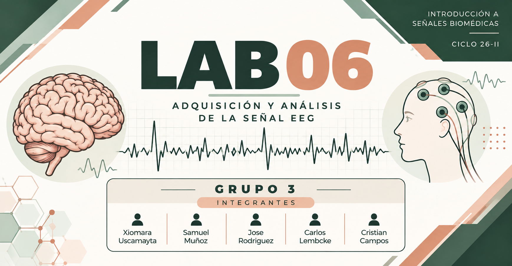

# 1. Introducción

La electroencefalografía (EEG) es una técnica utilizada para registrar la actividad eléctrica del cerebro mediante electrodos colocados sobre el cuero cabelludo. Las señales obtenidas permiten estudiar diferentes patrones de actividad cerebral y analizar sus componentes en distintas bandas de frecuencia.

En este laboratorio se realizó la adquisición y observación de señales EEG utilizando el sistema BITalino y el software OpenSignals. Se realizaron diferentes actividades experimentales con el propósito de observar las variaciones de la señal cerebral ante diferentes condiciones, como el estado basal, la apertura y cierre de los ojos, actividades de atención y procesamiento mental, así como la exposición a música suave y música fuerte o movida.

Las principales bandas de frecuencia estudiadas en el EEG son delta (0–4 Hz), theta (4–8 Hz), alpha (8–12 Hz), beta (12–25 Hz) y gamma (>25 Hz). Cada una de estas bandas puede presentar diferentes niveles de actividad dependiendo del estado y de la actividad realizada por el participante.

---

# 2. Objetivos

## 2.1. Objetivo general

Realizar la adquisición y análisis de señales electroencefalográficas (EEG) durante diferentes condiciones experimentales mediante el sistema BITalino y el software OpenSignals.

## 2.2. Objetivos específicos

- Registrar una señal EEG en condición basal.
- Observar los cambios de la señal durante la apertura y cierre de los ojos.
- Analizar la actividad cerebral durante tareas de atención y procesamiento mental.
- Observar la señal EEG durante una actividad específica correspondiente a la pregunta 5.
- Analizar el comportamiento de la señal ante música suave.
- Analizar el comportamiento de la señal ante música fuerte o movida.
- Comparar las señales obtenidas durante las diferentes condiciones experimentales con lo esperado teóricamente.

---

# 3. Materiales

Para la realización del laboratorio se utilizaron los siguientes materiales:

- BITalino (r)evolution.
- Sensor EEG.
- Electrodos adhesivos Ag/AgCl.
- Cable de referencia.
- Computadora.
- Software OpenSignals.
- Conexión Bluetooth.

---

# 4. Procedimiento experimental

## 4.1. Registro de la señal basal

En primer lugar, se realizó la adquisición de una señal EEG en condición basal. Durante esta etapa, el participante permaneció en reposo, evitando movimientos innecesarios para reducir la aparición de artefactos en la señal.

La señal basal permitió obtener un registro de referencia que posteriormente pudo ser comparado con las señales obtenidas durante las demás actividades.

### Fotografía del experimento

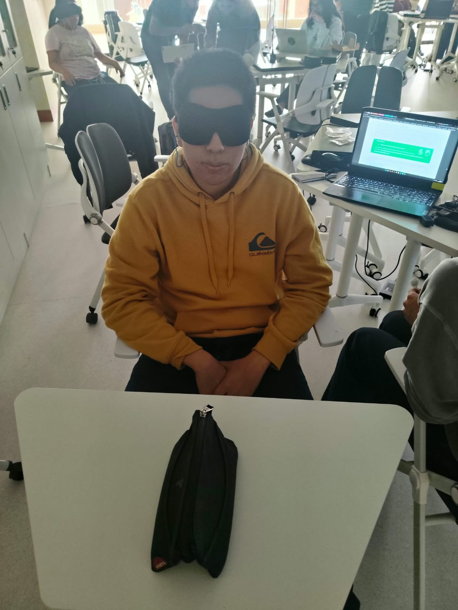

### Señal EEG registrada en OpenSignals

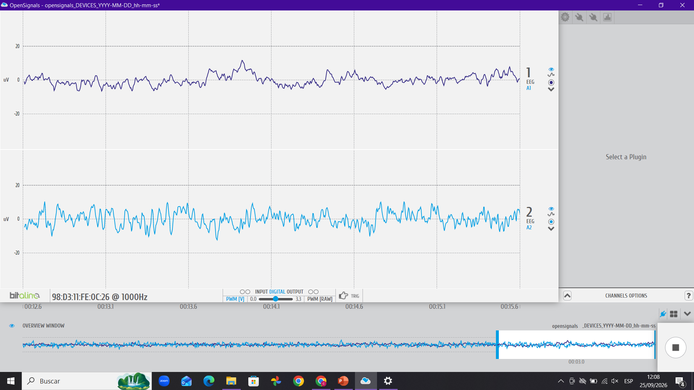

Teóricamente, durante el registro basal se esperaba obtener una señal relativamente estable, sin cambios bruscos producidos por movimientos voluntarios. La guía indica que para esta etapa se debe adquirir una señal con bajo nivel de ruido y sin movimientos, manteniendo una respiración normal y evitando movimientos oculares.

Por lo tanto, la señal basal sirve como referencia para comparar posteriormente los cambios producidos por las diferentes actividades.

---

# 4.2. Apertura y cierre de los ojos

Después del registro basal, se realizó la actividad de apertura y cierre de los ojos. El participante alternó entre mantener los ojos abiertos y cerrados mientras continuaba la adquisición de la señal EEG.

Esta actividad permite observar cambios en la actividad cerebral asociados con la condición visual.

### Fotografía del experimento

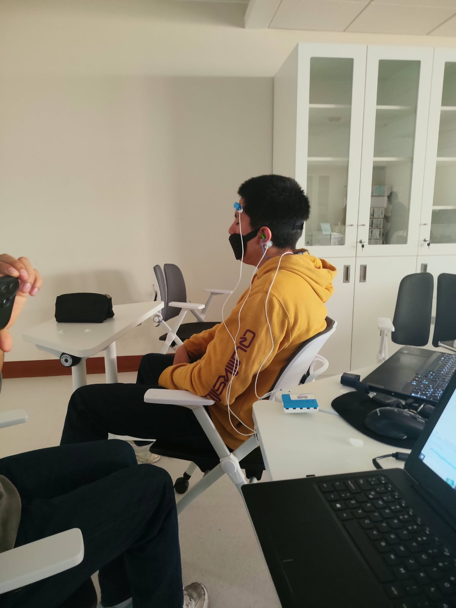

### Señal EEG registrada en OpenSignals

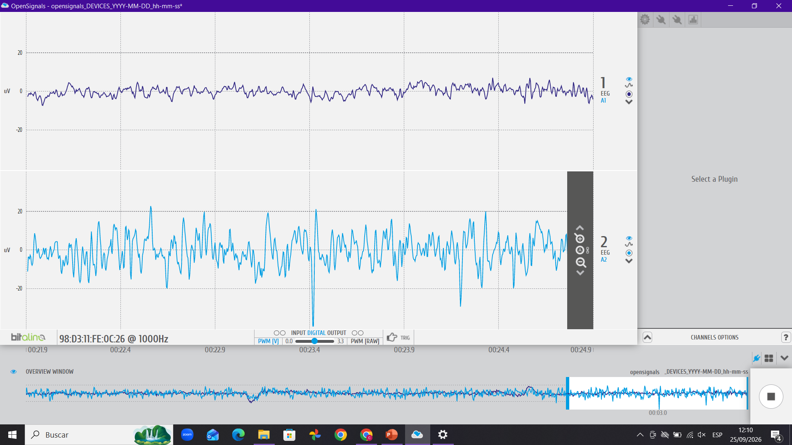

De acuerdo con la teoría presentada en la guía, durante el cierre de los ojos se espera observar una mayor presencia de actividad correspondiente a la banda alpha, cuya frecuencia se encuentra aproximadamente entre 8 y 12 Hz.

Por el contrario, cuando los ojos se encuentran abiertos, la actividad alpha puede disminuir. La guía muestra precisamente que las ondas alpha pueden distinguirse con mayor claridad durante los ojos cerrados. 

---

# 4.3. Actividad de preguntas

Posteriormente, se realizó una actividad basada en diferentes preguntas. Durante esta etapa, el participante debía prestar atención a las preguntas planteadas y realizar el procesamiento mental correspondiente mientras se continuaba registrando la actividad EEG.

Las preguntas realizadas fueron:

### Pregunta 1

**Pregunta:** [COMPLETAR AQUÍ LA PREGUNTA 1]

**Señal obtenida:**

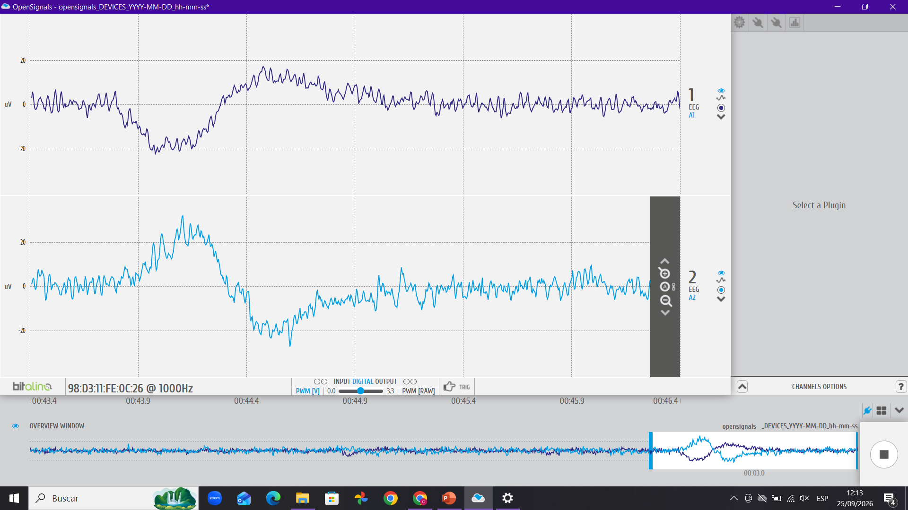

### Pregunta 2

**Pregunta:** [COMPLETAR AQUÍ LA PREGUNTA 2]

**Señal obtenida:**

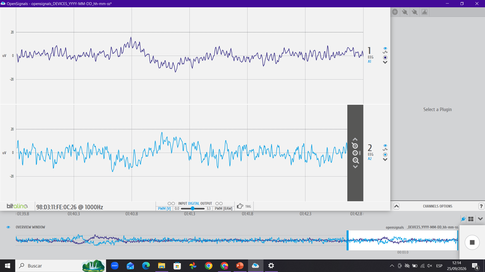

### Pregunta 3

**Pregunta:** [COMPLETAR AQUÍ LA PREGUNTA 3]

**Señal obtenida:**

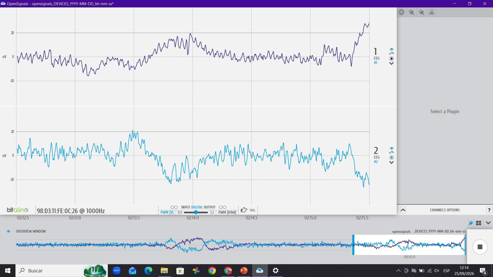

### Pregunta 4

**Pregunta:** [COMPLETAR AQUÍ LA PREGUNTA 4]

**Señal obtenida:**

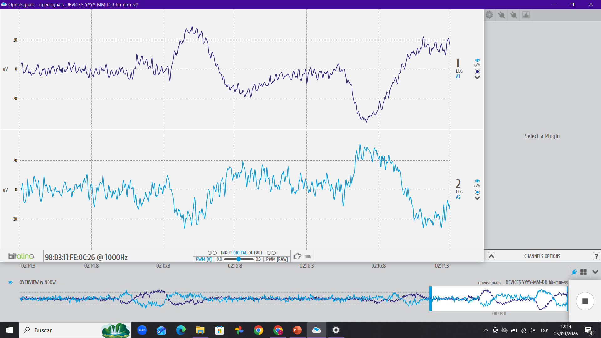

### Pregunta 5

**Pregunta:** [COMPLETAR AQUÍ LA PREGUNTA 5]

**Señal obtenida:**

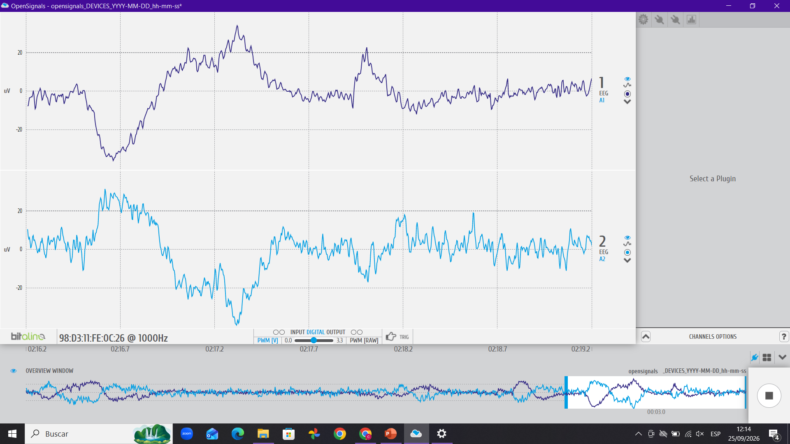

### Pregunta 6

**Pregunta:** [COMPLETAR AQUÍ LA PREGUNTA 6]

**Señal obtenida:**

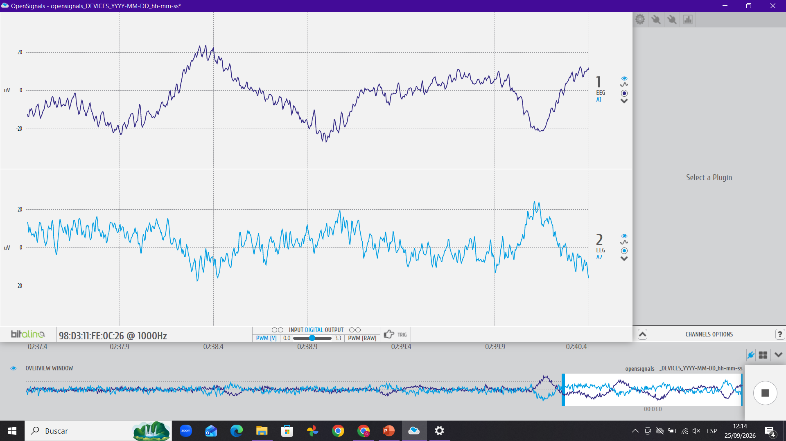

### Pregunta 7

**Pregunta:** [COMPLETAR AQUÍ LA PREGUNTA 7]

**Señal obtenida:**

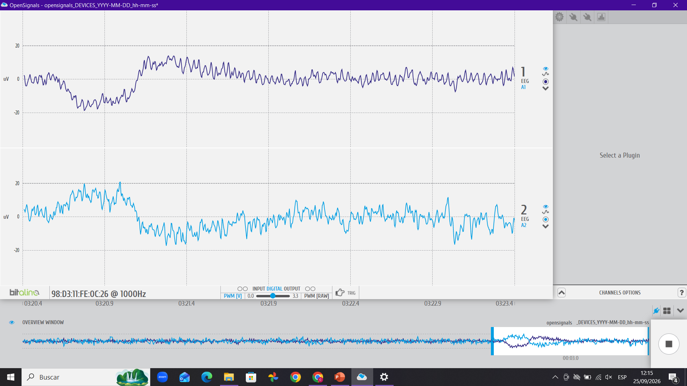

La actividad de preguntas implicaba mantener la atención y realizar procesamiento mental. En la guía del laboratorio se indica que la actividad cognitiva puede relacionarse con cambios en las bandas de frecuencia del EEG. En particular, la banda beta, situada entre 12 y 25 Hz, está relacionada con el pensamiento activo y la concentración. 

Por ello, durante las preguntas se esperaba encontrar modificaciones en la actividad EEG asociadas al procesamiento cognitivo. Sin embargo, no debe asumirse que cualquier cambio visible en la señal RAW representa directamente un aumento de concentración.

Las señales obtenidas para las diferentes preguntas pueden compararse entre sí y con la señal basal. Para una comprobación más precisa, sería necesario analizar las bandas de frecuencia y observar si existen cambios en la potencia de las bandas relacionadas con la actividad cognitiva.

---

# 4.4. Actividad correspondiente a la pregunta 5

Además de la actividad general de preguntas, se realizó un registro específico correspondiente a la pregunta 5.

### Señal EEG correspondiente a la pregunta 5

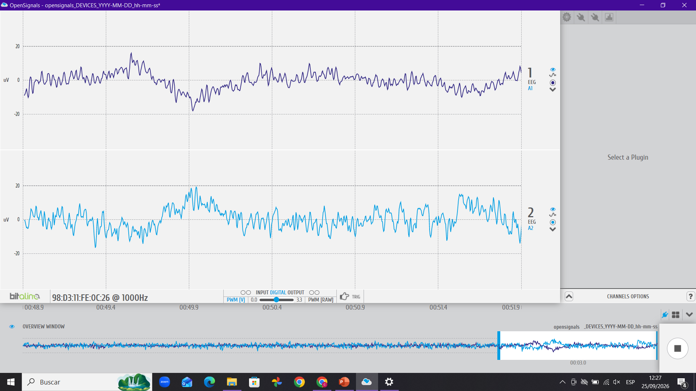

Al tratarse de una actividad que requiere atención y procesamiento mental, se esperaba que la señal presentara modificaciones respecto al estado basal. Desde el punto de vista teórico, la actividad relacionada con el pensamiento activo y la concentración puede estar asociada con la banda beta, ubicada entre 12 y 25 Hz.

---

# 4.5. Música suave

Después de las actividades cognitivas, se presentó un estímulo de música suave. Durante la reproducción del estímulo se continuó registrando la señal EEG.

### Señal EEG durante música suave – registro 1

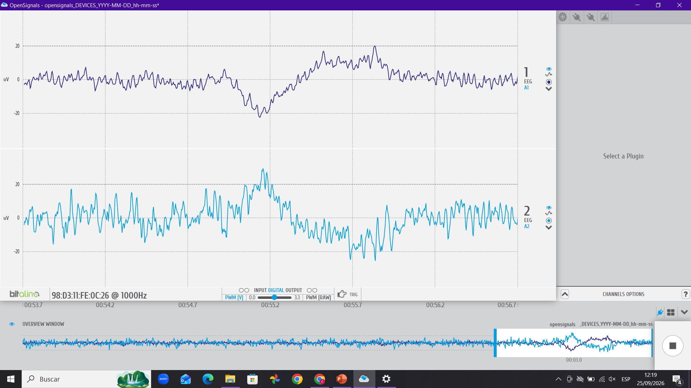

### Señal EEG durante música suave – registro 2

---

# 4.6. Música fuerte / música movida

Finalmente, se presentó un estímulo musical de mayor intensidad o ritmo, correspondiente a música fuerte o movida. Se continuó registrando la señal EEG durante esta condición.

### Señal EEG durante música fuerte

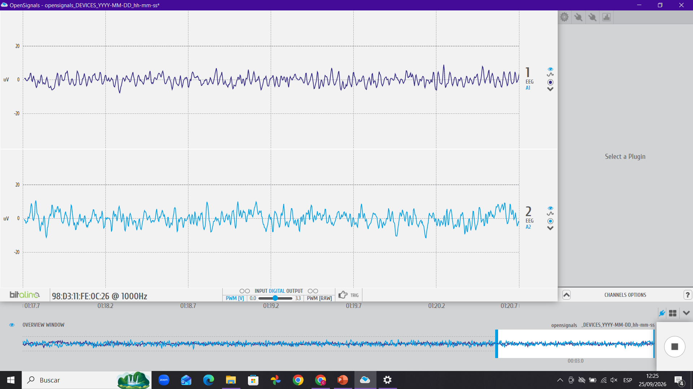

### Señal EEG durante música movida

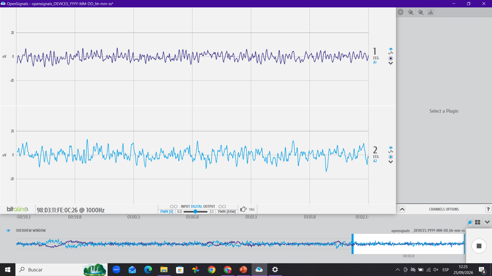

---

# 5. Comparación de las señales obtenidas

Durante el laboratorio se obtuvieron registros EEG correspondientes a diferentes condiciones experimentales: estado basal, apertura y cierre de los ojos, actividades de preguntas, pregunta 5, música suave y música fuerte o movida.

La señal basal permitió establecer una referencia para las comparaciones posteriores. En esta condición se esperaba obtener una señal relativamente estable y con pocos artefactos.

Durante la apertura y cierre de los ojos se esperaba observar principalmente modificaciones relacionadas con la actividad alpha. Según la guía, esta actividad puede distinguirse con mayor claridad durante los ojos cerrados. 

Durante las preguntas y la pregunta 5, la actividad cognitiva permitió analizar posibles modificaciones relacionadas con la atención y el procesamiento mental. La banda beta, ubicada entre 12 y 25 Hz, se encuentra relacionada con el pensamiento activo y la concentración según la guía. 

---

# 6. Artefactos y calidad de la señal

Durante la adquisición de EEG es importante considerar la presencia de artefactos. Debido a la alta amplificación del sensor EEG, pequeños movimientos pueden generar cambios importantes en la señal registrada.

Entre los principales artefactos se encuentran los movimientos oculares, el parpadeo, los movimientos de la mandíbula, la actividad muscular y el ruido eléctrico.

La guía señala específicamente que incluso pequeñas activaciones musculares, como los movimientos de los ojos o de la mandíbula, pueden producir artefactos en el registro EEG. 

Por este motivo, las variaciones observadas en las señales deben analizarse teniendo en cuenta tanto la actividad cerebral como las posibles interferencias presentes durante la adquisición.

---

# 7. Conclusiones

La realización del laboratorio permitió comprender el proceso de adquisición de señales electroencefalográficas mediante el sistema BITalino y el software OpenSignals.

La adquisición de una señal basal permitió establecer una referencia para las demás condiciones experimentales. Posteriormente, la actividad de apertura y cierre de los ojos permitió analizar cambios relacionados con la actividad alpha, especialmente durante el cierre de los ojos.

Las actividades de preguntas y la pregunta 5 permitieron observar el comportamiento de la señal durante tareas que requieren atención y procesamiento mental, teniendo como referencia la actividad de la banda beta.

Por otro lado, las condiciones de música suave y música fuerte o movida permitieron comparar experimentalmente la señal EEG ante diferentes estímulos auditivos.

Finalmente, el laboratorio permitió reconocer la importancia de controlar los movimientos y mantener una adecuada colocación de los electrodos, debido a la sensibilidad de la señal EEG frente a diferentes tipos de artefactos.

---

# 8. Señales procesadas en Python
