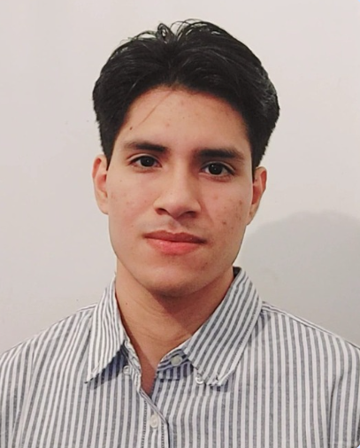
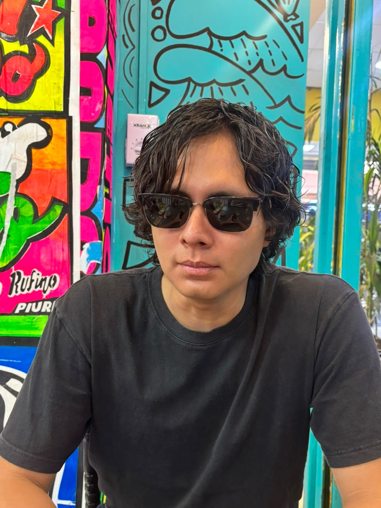
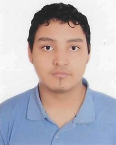
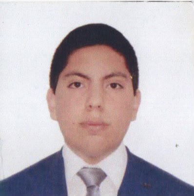

# Introduccion a señales biomédicas
## Ciclo 26-II

El presente repositorio albergará los entregables y avances a lo largo del ciclo 2026-II para el curso de *Introducción a Señales Biomédicas*.

Como equipo, buscamos fortalecer nuestros conocimientos en Ingeniería Biomédica mediante la aplicación práctica de conceptos relacionados con las bioseñales, promoviendo el trabajo colaborativo, el aprendizaje continuo y el desarrollo de nuestras habilidades.

Nuestro objetivo es desarrollar soluciones tecnológicas aplicadas a la salud, integrando el análisis de bioseñales y herramientas de Ingeniería Biomédica. Buscamos aplicar estos conocimientos para abordar problemas reales y generar propuestas útiles en el ámbito de la salud.

## Integrantes:

| Foto | Nombre | Presentación | Contacto |
| :---: | :--- | :--- | :--- |
|  | José Enrique Rodríguez Ramírez | Estudiante de septimo ciclo interesado en el área de ingeniería de tejidos | [jose.rodriguez.r@upch.pe](mailto:correo1@ejemplo.com) |
|  | Cristian Piero Campos Ticlla | Estudiante de octavo ciclo , área de interés ingeniería clinica | [Cristian.campos.t@upch.pe](mailto:correo2@ejemplo.com) |
|  | Xiomara Crystel Uscamayta Cabrera | Soy estudiante de séptimo ciclo de Ingeniería Biomédica. Mis principales áreas de interés son la Ingeniería Clínica y el procesamiento de señales e imágenes biomédicas. | [xiomara.uscamayta@upch.pe](mailto:correo3@ejemplo.com) |
|  | Carlos Ernesto Lembcke Vasquez | Estudiante de Septimo ciclo interesado en ingenería de tejidos y biomecánica | [carlos.lembcke@upch.pe](mailto:correo4@ejemplo.com) |
|  | David Muñoz Cabrera | Estudiante de septimo ciclo interesado en el área de ingeniería de tejidos e ingeniería clínica | [samuel.munoz@upch.pe](mailto:correo5@ejemplo.com) |

## Docentes

- **Moises Stevend Meza Rodriguez**
- **Jose Alonso Caceres Del Aguila**